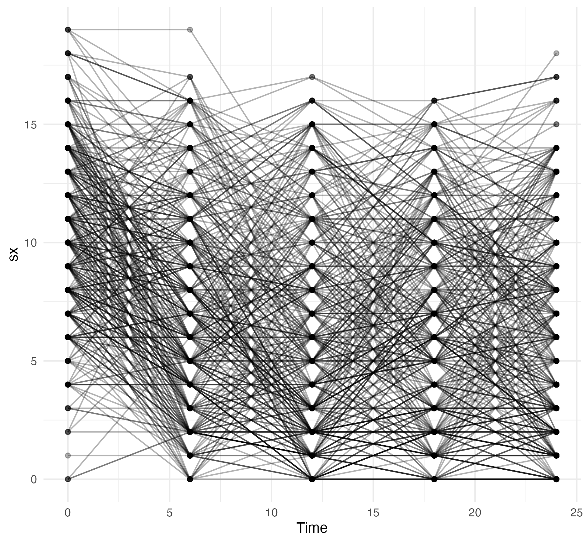
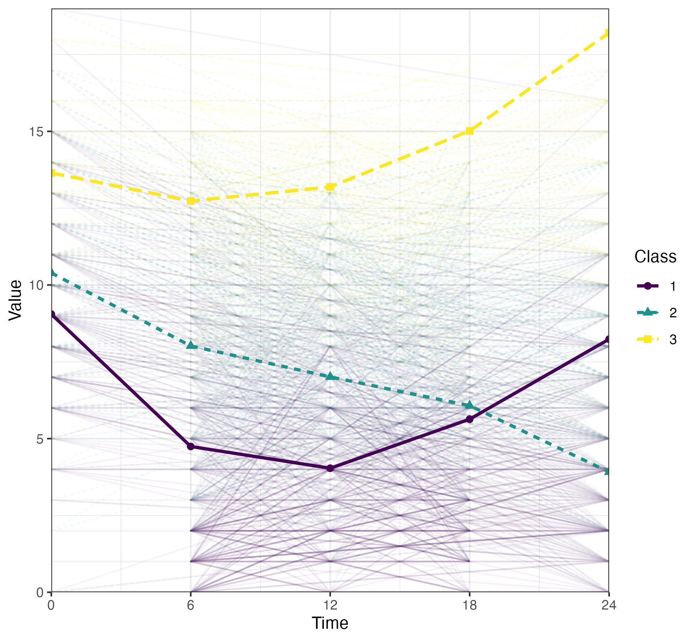
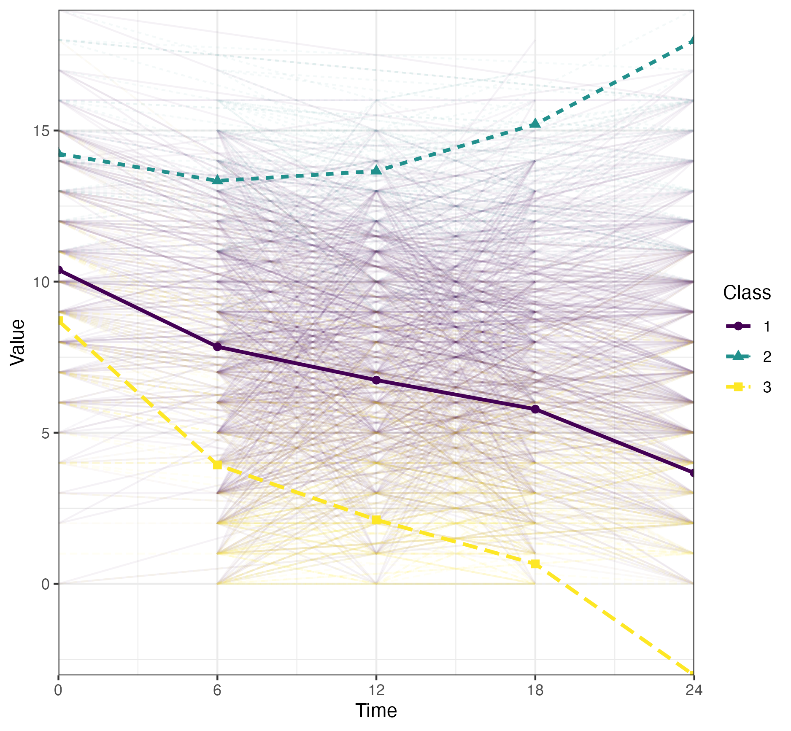
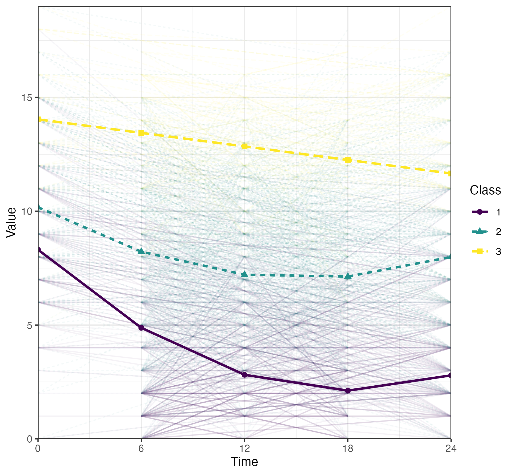

# MplusLGM

This package provides a comprehensive suite of functions for conducting and automating Latent Growth Modeling (LGM) in Mplus using R, including Growth Curve Models (GCM), Growth-Based Trajectory Models (GBTM) and Latent Class Growth Analysis (LCGA).

This package was build upon the capabilities from the [MplusAutomation](https://github.com/michaelhallquist/MplusAutomation) package. [Hallquist et al.(2018)](https://pmc.ncbi.nlm.nih.gov/articles/PMC6075832/). MplusAutomation: An R Package for Facilitating Large-Scale Latent Variable Analyses in Mplus. Structural equation modeling: a multidisciplinary journal.

Key features include:

  -   Generating model specifications (`LGMobject`)
  -   Running model & Replicating log-likelihood values (`runLGM`)
  -   Extracting model fit indices (`getFit`)
  -   Selecting best-fitting model (`getBest`)

This package was designed to implement and streamline the procedure for model selection outlined in: [Van Der Nest et al.(2020)](https://www.sciencedirect.com/science/article/pii/S1040260819301881?via%3Dihub). "An overview of mixture modelling for latent evolutions in longitudinal data: Modelling approaches, fit statistics and software." Advances in Life Course Research

  1.  Plotting individual trajectories of outcome (`getSpaghetti`)
  2.  Estimating 1-class GCM for reference (`fitGCM`)
  3.  Performing class enumeration with GBTM (`fitGBTM`)
  4.  Refining covariance structure in LCGA (`fitLCGA`)
  5.  Refining polynomial order (`getPoly`)

The following example illustrate the implementation of this workflow using the `mplusLGM` package. 
The example use a simulated dataset including symptom measurements on an arbitrary scale assessed at months 0, 3, 6, 9, 12, 18, 21 and 24.

## Installation

`MplusLGM` can be installed from CRAN or sourced directly from GitHub.

```
# From CRAN
install.packages("MplusLGM")

# From Github
devtools::install_github("olivierpds/MplusLGM")
```

Load the package and the simulated dataset into R.

```
# Load package
library(MplusLGM)

# Load simulated dataset 
data(symptoms)
```

<!-- 
```
setwd("~/Library/CloudStorage/OneDrive-McGillUniversity/CRISP/PhD/PEPP-Montreal/2.PEPP5/Analyses")

PEPP2_df <- list.files(file.path('..', '..', 'GitHub', 'PEPP_private', 'PEPP2', 'Data', 'SAV'),
  full.names = TRUE) %>%
  file.info() %>%
  filter(isdir == FALSE) %>% 
  slice_max(mtime) %>% # get the most updated file
  rownames() %>% 
  read_sav()

PEPP2_df <- PEPP2_df %>% 
  filter(pin <= 857) %>% 
  select(num_range(prefix = "SANS_", range = 0:24)) %>% 
  rename_with(~ paste("sx", c(0, 1, 2, 3, 6, 9, 12, 18, 24), sep = "_"), starts_with('SANS')) 
    
missings <- PEPP2_df %>% 
  map_dfc(\(x) sum(is.na(x)) / nrow(.) * 100) %>% 
  pivot_longer(cols = everything(),
               values_to = '%miss') %>% 
  pull("%miss") %>%
  round(0) 
    
missings[[2]] <- 15
  
PEPP2_df <- PEPP2_df %>% 
  filter(if_all(everything(), ~ !is.na(.x))) 
                  
symptoms <- modgo(data = PEPP2_df, n_samples = 350, generalized_mode = TRUE) %>% 
  pluck("simulated_data", 1) %>% 
  mutate(id = seq(350)) %>% 
  mutate(across(everything(), ~ round(., 0))) %>% 
  select(id, starts_with("sx")) 
  delete_MCAR(p = missings/100)
  
setwd("~/Library/CloudStorage/OneDrive-McGillUniversity/CRISP/PhD/PEPP-Montreal/Github/MplusLGM")
```
-->

## Step 1: Visual inspection - Spaghetti plot

Plot individual trajectories of symptoms to provide a visual representation of whether 
enough heterogeneity is evident in the data to justify the use of mixture modelling.

```         
spagh_plot <- getSpaghetti(
  data = symptoms, 
  outvar = paste("sx", seq(from = 0, to = 24, by = 6), sep = "_")
)

print(spagh_plot)
```

<!-- ggsave(spagh_plot, 
filename = file.path(getwd(), "Results", "Figures", "spahg_plot.png")) -->



## Step 2: Reference - Growth Curve Modelling (GCM)

Fit a GCM to represent the best single-class depiction of change against which subsequent models will be compared.

The maximum polynomial order should be selected based on the number of time points, the spaghetti plot and previous 
theoretical or practical insights to guide the initial scoping of potential models.

A linear model (i.e., polynomial order 1) will be estimated with the `fitGCM` function, as cubic and quadratic models failed to converge.

```         
# Fit GCM
GCM_model <- fitGCM(
  data = symptoms,
  outvar = paste("sx", seq(from = 0, to = 24, by = 6), sep = "_"), 
  idvar = "id",
  starting_val = 500,
  polynomial = 1,
  timescores = seq(from = 0, to = 24, by = 6),
  output = c("TECH1", "SAMPSTAT", "STANDARDIZED"),
  )

# Examine fit indices
GCM_fit <- getFit(GCM_model)

print(GCM_fit)
```
```
#              Title Observations Parameters        LL      BIC     aBIC      AIC     AICC     CAIC 
# 1 GCM_P1_K1_S1000;          350         10 -4873.299 9805.177 9773.454 9766.598 9767.247 9815.177
```

## Step 3: Class enumeration - Group-Based Trajectory Modeling (GBTM)

Fit a series of GBTM with an increasing number of classes to determine the optimal latent structure.

During class enumeration, the number of suspected classes should be selected based on the sample size, the spaghetti plot and
prior theoretical or practical insights to guide the initial scoping of potential models.

GBTM should converge the quickest to a solution given its lower number of free parameters when compared to other
LGM. Models with 2 to 6 latent classes will be evaluated using the `fitGBTM` function.

```         
# Fit GBTM
GBTM_models <- fitGBTM(
  data = symptoms,
  outvar = paste("sx", seq(from = 0, to = 24, by = 6), sep = "_"),
  idvar = "id",
  starting_val = 500,
  min_k = 2L,
  max_k = 6L,
  timescores = seq(from = 0, to = 24, by = 6),
  polynomial = 3,
  output = c("TECH1", "TECH11", "SAMPSTAT", "STANDARDIZED")
)

# Examine fit indices
GBTM_fit <- getFit(GBTM_models)

print(GBTM_fit)
```
<!--
  GBTM_fit %>%
  kbl() %>% 
  kable_classic() %>% 
  scroll_box(width = "100%", height = "200px") %>% 
  save_kable(file = file.path("Results", "Figures", "GBTM_fit.html"), self_contained = TRUE)
  -->

The optimal number of latent classes (K) will be determined using the Bayesian Information Criterion (BIC).
The difference in BIC between the K and K-1 models will be assessed using the Lo-Mendel-Rubin adjusted likelihood ratio test
(LMR-aLRT), as the Bootstrapped LRT (BLRT) provided inconclusive results.

Examining the fit indices, the GBTM with 4 latent classes had the best BIC value. However, the aLRT p-value 
was not significant (p > 0.05), indicating that the number of latent classes could be reduced to K = 3.

Alternatively, the `getBest` function can be used to select the best-fitting model according to the same
criteria.

```         
# Select best-fitting GBTM
GBTM_best <- getBest(
  lgm_object = GBTM_models, 
  ic = "BIC",
  lrt = "aLRT", 
  p = 0.05
  )
```
```
# The model with the best BIC value is: GBTM_P3_K4_S1000.
# The T11_LMR_PValue p-value was not significant (p > 0.05), indicating that the number of classes (K) could be reduced to K = 3.
# The suggested best-fitting model is: GBTM_P3_K3_S1000.
```

Inspect the trajectory plots at each step to ensure that the emergent patterns are sensible by considering 
their empirical implications and whether the trajectories are distinct.

```         
# Plot best-fitting GBTM
GBTM_plot <- MplusAutomation::plotGrowthMixtures(
  GBTM_best,
  bw = FALSE,
  rawdata = TRUE,
  alpha_range =c(0, 0.05),
  time_scale = seq(from = 0, to = 24, by = 6)
)

print(GBTM_plot)
```

<!-- ggsave(GBTM_plot, 
filename = file.path("Results", "Figures", "GBTM_plot.png")) -->



## Step 4: Refine Covariance Structure - Latent Class Growth Analysis (LCGA)

Fit a series of LCGA to determine the optimal covariance structure, progressively relaxing the assumptions of
equal residual variance across time and/or class.

LCGA models with 3 latent classes will be estimated using the `fitLCGA` function, allowing for residual variance to vary:

  - across time
  - across class
  - across both time and class

```         
# Run LCGA models
LCGA_models <- fitLCGA(
  data = symptoms,
  outvar = paste("sx", seq(from = 0, to = 24, by = 6), sep = "_"),
  idvar = "id",
  starting_val = 500,
  k = 3L,
  timescores = seq(from = 0, to = 24, by = 6),
  polynomial = 3,
  output = c('TECH1', 'TECH11', 'SAMPSTAT', 'STANDARDIZED'),
  wd = 'Results'
)
  
# Examine fit indices
LCGA_fit <- getFit(c(GBTM_best, LCGA_models))

print(LCGA_fit)
```

<!--
  LCGA_fit %>%
  kbl() %>% 
  kable_classic() %>% 
  scroll_box(width = "100%", height = "200px") %>% 
  save_kable(file = file.path("Results", "Figures", "LCGA_fit.html"), self_contained = TRUE)
  -->

<iframe src="https://olivierpds.github.io/MplusLGM/LCGA_fit.html" width="100%" height="300px" style="border:none;"></iframe>

Examining the fit indices of the LCGA models in comparison to the best-fitting GBTM, the LCGA
with relaxed residual variance across class had the best BIC value. The aLRT p-value 
was significant (p <= 0.05), indicating that the number of classes couldn't be further reduced.

```
# Select best-fitting GBTM
LCGA_best <- getBest(
  lgm_object = c(GBTM_best, LCGA_models),
  ic = "BIC"
  )
```

```
# The model with the best BIC value is: LCGA_C_P3_K3_S1000;
# Note: The T11_LMR_PValue p-value is significant (p <= 0.05), indicating that the number of classes cannot be reduced.
```

```         
# Plot best-fitting GBTM
LCGA_plot <- MplusAutomation::plotGrowthMixtures(
  LCGA_best,
  bw = FALSE,
  rawdata = TRUE,
  alpha_range =c(0, 0.05),
  time_scale = seq(from = 0, to = 24, by = 6)
)

print(LCGA_plot)
```
<!-- LCGA_plot %>% 
ggsave(filename = file.path("Results", "Figures", "LCGA_plot.png")) -->



## Step 5: Refine Polynomial Order

Remove the highest-order polynomial terms that are non-significant iteratively per class and re-running the updated models 
using the `getPoly` function.

```         
# Refine polynomial order
final_model <- getPoly(
  lgm_object = LCGA_best, 
  wd = 'Results')
```

```
# Class 3: the highest-order polynomial term was not significant (p > 0.05) and was removed CUB@0
# Class 2: the highest-order polynomial term was not significant (p > 0.05) and was removed CUB@0
# Class 1: the highest-order polynomial term was not significant (p > 0.05) and was removed CUB@0
# 
# Class 3: the highest-order polynomial term was not significant (p > 0.05) and was removed Q@0
# 
# [1] "The highest-order polynomial term is significant (p < 0.05) across all classes."
```
  
```
# Examine fit indices 
final_fit <- getFit(final_model)

print(final_fit)
```
<!--
  final_fit %>%
  kbl() %>% 
  kable_classic() %>% 
  scroll_box(width = "100%", height = "200px") %>% 
  save_kable(file = file.path("Results", "Figures", "final_fit.html"), self_contained = TRUE)
  
   as.character() %>% 
  cat() -->
  
<iframe src="https://olivierpds.github.io/MplusLGM/final_fit.html" width="100%" height="300px" style="border:none;"></iframe>

```
# Plot final model
final_plot <- MplusAutomation::plotGrowthMixtures(
  final_model,
  bw = FALSE,
  rawdata = TRUE,
  alpha_range =c(0, 0.05),
  time_scale = seq(from = 0, to = 24, by = 6)
)

print(final_plot)
```

<!-- ggsave(LCGA_plot, 
filename = file.path(getwd(), "Results", "Figures", "final_plot.png")) -->


